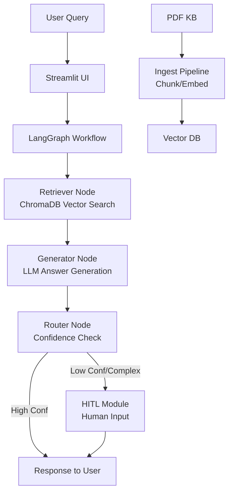

# High-Level Design (HLD): RAG Customer Support Assistant

## 1. System Overview
**Problem:** E-commerce customers need instant, accurate support from FAQ knowledge base. Simple chatbots fail on complex queries.

**Scope:** 
- Ingest PDF support docs
- RAG for contextual answers
- Graph workflow for routing
- HITL escalation
- CLI/Web UI

## 2. Architecture Diagram

## 3. Component Description
| Component | Description | Tech |
|-----------|-------------|------|
| Document Loader | Load PDF/TXT | PyPDF/TextLoader |
| Chunking | 500 char chunks, overlap 50 | RecursiveCharacterTextSplitter |
| Embedding | 384-dim vectors | all-MiniLM-L6-v2 |
| Vector Store | Persistent storage | ChromaDB |
| Retriever | Top-k=4 similarity | Chroma.as_retriever |
| LLM | Generation | Ollama llama3.2 / GPT-4o-mini |
| Graph Engine | Workflow | LangGraph StateGraph |
| Router | Intent/confidence | Custom node |
| HITL | Escalation | CLI prompt |
| UI | Interface | Streamlit chat |

## 4. Data Flow
1. Ingestion (one-time): PDF → chunks → embeddings → Chroma
2. Query: User input → graph → retrieve → prompt LLM → score → output or HITL

## 5. Technology Choices
- **ChromaDB:** Local, fast, persistent vector DB
- **LangGraph:** Flexible graph workflows > linear chains
- **Local Models:** Cost-free, privacy; Ollama easy setup
- **Streamlit:** Quick Web UI

## 6. Scalability
- Large docs: Hierarchical indexing
- Query load: Async graph, multiple workers
- Latency: <2s retrieval + gen, cache common queries

Export to PDF: `pandoc hld.md -o hld.pdf --pdf-engine=weasyprint`

